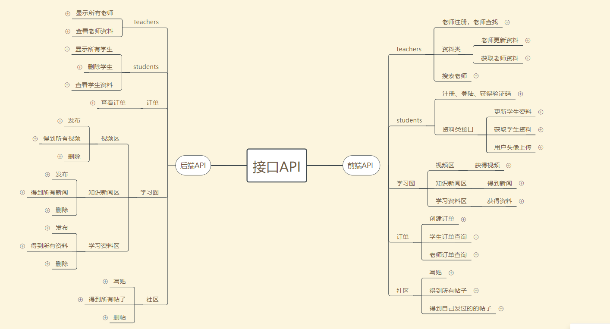

	

<h2>API</h2>
<h3>说明:</h3>
<ul>
      <li>id都为int类型，其他字段都为string类型！</li>
      <li>status：  0表示成功，1表示失败</li>
      <li>message:具体的消息信息</li>
    </ul>
<body>
 <h4>获取验证码</h4>    
       接口：/verify 
       请求：GET 
       参数：stu_phone   手机号 
       调用形式：/verify?stu_phone=15690580872 
       
       成功返回值：
                {
                    status:0,
                    stu_phone,//用户收到的验证码
                    message:'请求成功'
                }
              
            }
       错误返回值:
            {
                   status:1,
                   message:errorMessage
            }    
            );
----------------------------------------------------- 学生 ----------------------------------------------------------

<h4>学生注册</h4>
       接口：/register_stu 
       请求：POST 
       参数：stu_phone  手机号 
                   stu_password  密码
         
       调用形式：/register_stu 
        
       成功返回值：
                {
                    status:0,
                    info    : 'OK',
                    message:'注册成功'
                }
              
            }
       错误返回值:
                {
                   status  : 1,
                info    : 'error',
                message:'注册失败'
            }    
            );          

  <h4>学生登陆</h4>
       接口：/login 
       请求：POST 
       参数：stu_phone  手机号 
                 stu_password  密码
        
       调用形式：/login 

       成功返回值：
                {
                    status:0,
                    info    : 'OK',
                    tokenID:(用户tokenID,唯一标识)
                    tea_token:(若已经为老师则此值为老师id,若未注册老师，此值为null)
                     information 用户的所有资料
                    message:'密码匹配正确'
                }
              
            }
       错误返回值:{
                   status:1,
                    info    : 'error',
                    message:'密码匹配错误'
            }    
            ); 

  <h4>更新学生资料</h4>    
        接口：/updata_stu 
        请求：POST 
        调用形式：/updata_stu 
        参数：
         stu_id  查找学生用 
         stu_name 
         stu_age  
         stu_sex  
         stu_grade
         

        成功返回值：
                {
                    status:0,
                    message:'修改成功'
                }
              
            }
        错误返回值:{
                   status:1,
                   message:errorMessage
            }    
            );

  <h4>获取学生资料</h4>
        接口：/showdata_stu 
        请求：get 
        调用形式：/showdata_stu?stu_id=? 
        参数：stu_id 
            
        成功返回值：
                {
                     array[object]
                }
              
            }
        错误返回值:{
                   status:1,
                   message:errorMessage
            }    
            );

  <h4>头像上传</h4>
        接口：/upload_head 
        请求：post 
        参数：stu_id 用户id 
                    file文件 
         
            
        成功返回值：
                {
                    status:0,
                    headurl:url,
                    info:'ok',
                    message:'成功'
                }
              
            }
        错误返回值:{
                   status:1,
                   message:errorMessage
            }    
            );

----------------------------------------------------- 老师 ----------------------------------------------------------
  <h4>注册老师</h4>
        接口：/register_tea 
        请求：POST 
        参数：tea_name  教师姓名 
             tea_age  教师年龄 
             tea_sex  教师性别 
             tea_email  教师邮箱 
             stu_grade   可教的学生年级 
             stu_courses  可教的学生科目 
             tea_school    老师所在学校 
             tea_major     老师专业 
             tea_grade   老师所在年级 
             userID      老师身份证号码 
             remark      备注信息 
             stu_token   学生ID 
         
        调用形式：/register_tea 

        成功返回值：
                {
                    status:0,
                    info    : 'OK',
                    tea_ID:(老师用户tokenID,唯一标识)
                    message:'注册成功'
                }
              
            }
        错误返回值:{
                   status  : 1,
                info    : 'error',
                tea
                message:'注册失败'
            }    
            ); 

  <h4>查找老师</h4>
        接口：/select_tea 
        请求：get 
        参数：无调用参数 
        调用形式：/select_tea 
        
         成功返回值：
                {
                array[object]  //返回一个数组，每个老师的信息为数组中的一个对象
                }
              
            }

  <h4>老师更新资料</h4>
        接口：/updata_tea 
        请求：post 
        参数: 
                  tea_id  查找老师用 
                  tea_name  
                  tea_age  
                  tea_sex  
                  tea_email  
                  stu_grade  
                  stu_courses  
                  tea_school  
                  tea_major  
                  tea_grade  
                  remark =  
         

        失败
                 {
                status: 1,
                info: 'error',
                message: '数据库错误，未能更新资料'
                 }
        成功            status: 0,
                info: 'or',
                message: '更新成功'

  <h4>获取老师资料</h4>
        接口：/showdata_tea 
        请求：get 
        参数：
            tea_id
         
        调用形式：/showdata_tea?tea_id=? 

        成功返回值：
                {
                     array[object]
                }
              
            }
        错误返回值:{
                   status:1,
                   message:errorMessage
            }    
            );

  <h4>搜索老师</h4>
        接口：/search 
        请求：get 
        参数：
           search_txt
         

        成功返回值：
                {
                     array[object]
                }  
            }
        错误返回值:{
                   status:1,
                   message:errorMessage
            }    
            );

----------------------------------------------------- 老师 ----------------------------------------------------------

----------------------------------------------------- 视频 ----------------------------------------------------------

  <h4>获得视频</h4>
        接口：/select_video 
        请求：get 
        参数：无调用参数 
        调用形式：/select_video 
        
         成功返回值：
                {
                array[object]  //返回一个数组，每个视频的信息为数组中的一个对象
                }
              
            }

----------------------------------------------------- 视频 -----------------------------------------------------------

----------------------------------------------------- 订单 -----------------------------------------------------------
  <h4>创建订单</h4>
        接口：/order_set 
        请求：POST 
        参数：
            stu_id 学生ID int 
            tea_id 老师ID int  
            class_time 上课时间  string  
            order_address 上课地址  string  
             order_time  订单时间  
             order_course 预约上课科目  
         
        调用形式：/order_set 

        成功返回值：
                {
                status: 0,
                    info: 'OK',
                    message: '订单生成成功'
                }
        错误返回值：
                status: 1,
                    info: 'error2',
                    message: '数据库写入错误'
            }

  <h4>学生订单查询</h4>
        接口：/select_order_stu 
        请求：get 
        参数：
            stu_id 学生ID int  
         
        调用形式：/select_order_stu?stu_id=1老师订单查询</h4>
        接口：/select_order_tea 
        请求：get 
        参数：
            stu_id 老师ID int
         
        调用形式：/select_order_tea?tea_id=1 
        
        成功返回值：
                {
                 array[object]  订单详情的数组，每个object为一个订单详细信息
                }
        错误返回值：
                status: 1,
                    info: 'error2',
                    message: '错误'
            }

  <h4>找回密码发送验证码</h4>
        接口：/findVerify 
        请求：get  
        参数：
            stu_phone 用户手机号 int
         
        调用形式：findVerify？stu_phone = ? 

        成功返回值：
                {
                    status:0,
                    stu_phone,//用户收到的验证码
                    message:'请求成功'
                }
              
            }
        错误返回值:{
                   status:1,
                   message:errorMessage
            }    
            );

  <h4>更改密码</h4>
        接口：/forget 
        请求：POST 
        参数：
            stu_phone 用户手机号 int 
            stu_password 新密码 int 
         
        调用形式：/forget 

        成功返回值：
                {
                    status:0,
                    message:'修改成功'
                }
              
            }
        错误返回值:{
                   status:1,
                   message:errorMessage
            }    
            );

  <h4>社区学习圈板块222</h4>
      <h5>写贴</h5>
        /writeNote 
        接口：/writeNote 
        请求：POST 
        参数：
           poster_id 学生id 
            content 发帖内容 
            img 图片 
         

        成功返回值：
               status:0,
                info:'ok',
                message:'成功'
              
            }
        错误返回值:{
                    status:1,
                    info:'error',
                    message:'数据库错误'
            }    
            );

  <h4>得到所有帖子</h4>
        接口：/getAllNotes 
        请求：get 
        参数：无 
          
        成功返回值：
              array[object]
            }
        错误返回值:{
                    status:1,
                    info:'error',
                    message:'数据库错误'
            }    
            );

  <h4>得到自己的帖子</h4>
        接口：/getOwnNotes 
        请求：get 
        参数：stu_id 
          
        成功返回值：
              array[object]
            }
        错误返回值:{
                    status:1,
                    info:'error',
                    message:'数据库错误'
            }    
            );

------------------------------------------------------ 学习圈0 ------------------------------------------------------
  <h4>学习视频</h4>
        接口：/video 
        请求：get 
        参数：无 
          
        成功返回值：
              array[object]
            }
        错误返回值:{
                    status:1,
                    info:'error',
                    message:'数据库错误'
            }    
            );

  <h4>新闻</h4>
        接口：/news 
        请求：get 
        参数：无 
          
        成功返回值：
              array[object]
            }
        错误返回值:{
                    status:1,
                    info:'error',
                    message:'数据库错误'
            }    
            );

  <h4>资料</h4>
        接口：/learnFile 
        请求：get 
        参数：fileVerify   资料分类识别码 
          
        成功返回值：
              array[object]
            }
        错误返回值:{
                    status:1,
                    info:'error',
                    message:'数据库错误'
            }    
            );

  <h3>后端接口</h3>
------------------------------------------------------- back ---------------------------------------------------------
  <h4>查找所有学生</h4>
        接口：/getStu 
        请求：get 
        参数：无 

          
        成功返回值：
              array[object]
            }
        错误返回值:{
                    status:1,
                    info:'error',
                    message:'数据库错误'
            }    
            );

  <h4>删除学生</h4>
        接口：/deStu 
        请求：get 
        参数：stu_id 
          
        成功返回值：
               status:0,
                info:'ok',
                message:'删除成功'
            }
        错误返回值:{
                    status:1,
                    info:'error',
                    message:'数据库错误'
            }    
            );

  <h4>查看订单</h4>
        接口：/showOrders 
        请求：get 
        参数：无 
          
        成功返回值：
              array[object]
            }
        错误返回值:{
                    status:1,
                    info:'error',
                    message:'数据库错误'
            }    
            );

  <h4>删除视频</h4>
        接口：/deVideo 
        请求：get 
        参数：id  视频id 
          
        成功返回值：
               status:0,
                info:'ok',
                message:'删除成功'
            }
        错误返回值:{
                    status:1,
                    info:'error',
                    message:'数据库错误'
            }    
            );

            
  <h4>删除新闻</h4>
        接口：/delNews 
        请求：get 
        参数：id  新闻id 
          
        成功返回值：
               status:0,
                info:'ok',
                message:'删除成功'
            }
        错误返回值:{
                    status:1,
                    info:'error',
                    message:'数据库错误'
            }    
            );

  <h4>发布视频</h4>
        接口：/createVideo 
        请求：post 
        参数：course_name 视频名
                    course_time       发布时间 
                    course_author     发布作者 
         

        成功返回值：
               status:0,
                info:'ok',
                message:'上传成功'
            }
        错误返回值:{
                    status:1,
                    info:'error',
                    message:'数据库错误'
            }    
            );

  <h4>上传学习文件</h4>
        接口：/upLearnFile 
        请求：post 
        参数：var file_name  文件名 
                    upload_time    上传时间 
                    upload_peo    上传人 
                    fileVerify    文件识别码  0为初中1为高中2为推荐 
                    srore   文件评分 
        

        成功返回值：
               status:0,
                info:'ok',
                message:'上传成功'
            }
        错误返回值:{
                    status:1,
                    info:'error',
                    message:'数据库错误'
            }    
            );

  <h4>删除学习资料</h4>
        接口：/delLearnFile 
        请求：get 
        参数：id  文件id 
          
        成功返回值：
               status:0,
                info:'ok',
                message:'删除成功'
            }
        错误返回值:{
                    status:1,
                    info:'error',
                    message:'数据库错误'
            }    
            );

  <h4>删帖子</h4>
        接口：/delposter 
        请求：get 
        参数：co_id 
          
        成功返回值：
               status:0,
                info:'ok',
                message:'删除成功'
            }
        错误返回值:{
                    status:1,
                    info:'error',
                    message:'数据库错误'
            }    
            );           

  <h4>新闻发布</h4>
        接口：/writeNew 
        请求：post 
        参数：header 
             content 
             time 
         

        成功返回值：
               status:0,
                info:'ok',
                message:'发布成功'
            }
        错误返回值:{
                    status:1,
                    info:'error',
                    message:'数据库错误'
            }    
            ); 
</body>